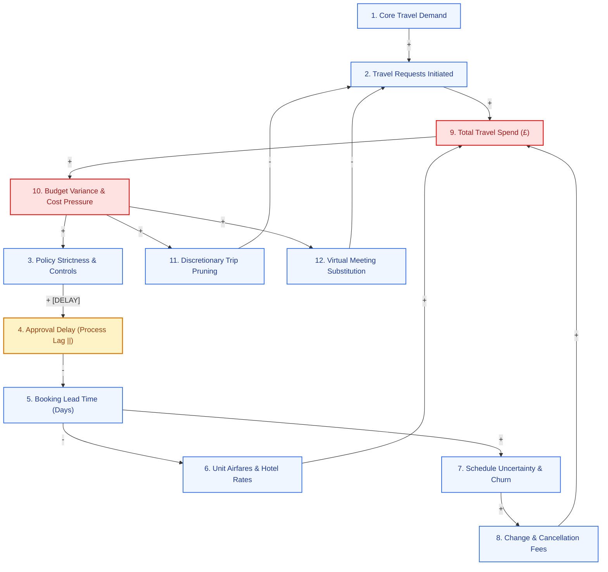

# Travel Cost & Systems Optimisation Challenge

This project is based on synthetic data. It simulates a business with rising travel spend, and I have been tasked with understanding where cost is structural and where it is avoidable. The aim is to suggest interventions to reduce spend without damaging client delivery, collaboration or growth.

---

<!-- STEP_1_START -->
## 1. What are the most important drivers of travel spend?

| Category    | Driver                | Evidence (Synthetic Data)                                  | Operational Mechanism                                                                                 |
|:------------|:----------------------|:-----------------------------------------------------------|:------------------------------------------------------------------------------------------------------|
| Demand      | Route Distance        | r = 0.66 correlation with total spend                      | Longer flight routes require structurally higher fuel and base ticketing costs.                       |
| Demand      | Trip Purpose          | Client meetings £2,108.09 vs Delivery £1,931.15            | Commercial and client-facing trips involve premium hub destinations and inflexible arrival schedules. |
| Price       | Peak Surge Pricing    | £224.10/night (peak) vs £180.60 (standard)                 | Dynamic hotel inventory algorithms during city-wide event windows impose a 24.1% rate premium.        |
| Price       | Cabin Class Mix       | Business £3,159.52 vs Economy £897.86 (176 trips)          | Premium cabin selection multiplies baseline airfare by 3.5x across commercial travel.                 |
| Process     | Approval Friction     | r = -0.10 with booking lead time                           | Multi-day management approval bottlenecks compress the available advance booking window.              |
| Process     | Late Booking Penalty  | 0-3d: £1,319.20 vs 15-30d: £885.54                         | Booking within 72 hours triggers an average £433.65 yield penalty per flight.                         |
| Behavioural | Policy Non-Compliance | Non-compliant £2,404.26 vs Compliant £1,915.56 (460 trips) | Booking outside negotiated channels or policy caps adds £488.71 of excess cost per trip.              |

### Key Diagnostic Takeaways
* **Structural Baseline:** Route distance ($r = 0.66$) and duration ($r = 0.42$) dictate the baseline demand, which are unavoidable unless you are willing to directly affect the business.
* **Compounding Process Bottlenecks:** Management approval delays compress booking lead windows, forcing travellers into high-cost, short-notice tiers that add an average £433.65 surcharge per ticket.
* **Controllable Price & Behavioural Leakage:** Premium cabin selections, peak event hotel surges, and policy non-compliance (£488.71 excess cost per non-compliant trip) drive avoidable financial leakage that targeted interventions can capture without a blanket travel freeze.
<!-- STEP_1_END -->

## 2. Causal Loop Diagram (CLD)
Here I have constructed a Causal Loop Diagram. This serves as a hypothesis for how the drivers of travel spend interact, motivated by some of the data from Step 1 as well as a general understanding of corporate structure.

<!-- STEP_2_START -->

### Explanation of The 12 Variables
1. **Core Business Demand:** Underlying commercial requirement for client delivery, business development, and delivery milestones.
2. **Travel Requests Initiated:** Volume of trip bookings formally submitted by employees.
3. **Policy Strictness & Controls:** Management implementation of pre-trip approval gates and scrutiny.
4. **Approval Delay (Explicit Delay $||$):** The multi-day administrative lag between request submission and manager sign-off.
5. **Booking Lead Time:** Days between flight/hotel booking confirmation and departure date.
6. **Unit Airfares & Hotel Rates:** Market ticket prices governed by airline yield algorithms and hotel peak tiers.
7. **Schedule Uncertainty & Churn:** Likelihood that client deliverables, meetings, or project dates shift.
8. **Change & Cancellation Fees:** Friction penalties paid to amend, rebook, or forfeit tickets.
9. **Total Travel Spend:** Aggregate organizational expenditure across travel categories.
10. **Budget Variance & Cost Pressure:** Executive distress when spend exceeds allocated targets.
11. **Discretionary Trip Pruning:** Management rejection of internal workshops, training, and non-essential travel.
12. **Virtual Meeting Substitution:** Shifting face-to-face engagements to digital channels (Teams/Zoom).

---

### Feedback Loops Breakdown

* **$R_1$: The Bottleneck Trap (Reinforcing Loop — Unintended Cost Inflation)**
  * **Mechanism:** Spend exceeds budget → Budget Pressure rises ($+$) → Leadership implements tighter approval controls ($+$) → **[DELAY]** Approval Delays lengthen ($+$) → Booking Lead Time compresses ($-$) → Unit Airfares jump due to short-notice airline yield tiers ($-$) → Total Spend increases ($+$).
  * **Takeaway:** Governance designed to restrict spending inadvertently increases ticket prices by stripping employees of advance purchase discounts.

* **$R_2$: The Volatility Trap (Reinforcing Loop — Early Booking Flexibility Penalty)**
  * **Mechanism:** Mandating advance bookings ($+$ Lead Time) → Increases exposure to client schedule changes and project date shifts ($+$ Schedule Uncertainty) → Higher rate of flight modifications and cancellations ($+$) → Change & Cancellation Fees rise ($+$) → Total Spend rises ($+$).
  * **Takeaway:** Advance booking discounts carry a real trade-off against scheduling issues; booking too far out inflates change fees.

* **$B_1$: Virtual Substitution (Balancing Loop — Demand Dampening)**
  * **Mechanism:** Budget Pressure ($+$) → Virtual Meeting Substitution rises ($+$) → Travel Requests Initiated falls ($-$) → Total Travel Spend drops ($-$).
  * **Takeaway:** Rising cost pressure naturally pushes teams toward digital alternatives for routine internal collaboration.

* **$B_2$: Discretionary Trip Pruning (Balancing Loop — Governance Intervention)**
  * **Takeaway:** Budget Pressure ($+$) → Management rejects non-essential travel ($+$) → Discretionary requests fall ($-$) → Total Travel Spend drops ($-$).
<!-- STEP_2_END -->

## 3. Quantification: Avoidable Cost Spend
<!-- STEP_3_START -->

To prevent overlapping estimates (double-counting) the figures have been calculated with a waterfall methodology. We first calculated a baseline daily rate based on the trips that did everything right (e.g. Economy Class, Policy Compliant, Booked in Advance). Then, this gives an upper ceiling for how much money one can save on a trip, given by Actual Cost - Target Cost. 

| Efficiency Lever                           | Calculation Logic & Confounder Control                                                        | Net Recoverable (£)              |
|:-------------------------------------------|:----------------------------------------------------------------------------------------------|:---------------------------------|
| 1. Advance Booking Optimization (0-7 Days) | Targeted 15-30 day advance window. Deducted £12+ expected schedule churn risk per ticket.     | £350,879.70                      |
| 2. Unauthorized Premium Cabin (Non-MD)     | Isolated Business Class base fares. Excluded Managing Directors to respect policy allowances. | £207,186.48                      |
| 3. Policy Non-Compliance & Peak Surge      | Captured remaining trip-level variance strictly tied to off-channel booking or event surges.  | £231,351.08                      |
| **Total Avoidable Spend**                  | **Strict row-by-row waterfall limits savings to mathematical maximums.**                      | **£789,417.25 (15.7% of Spend)** |

### Key Financial Insights
* **The Flexibility Trade-off:** Pushing short-notice bookings into the 15-30 day window yields significant base airfare discounts, but the net savings are partially offset by the statistical increase in schedule churn (cancellation fees). The £350,880 figure represents pure net opportunity.
* **Controlled Enforcement:** By excluding authorized executive travel (Managing Directors) from the premium cabin calculations, the £207,186 identified represents genuine behavioral policy leakage rather than structural seniority allowances.
* **Total Opportunity:** The organization is losing approximately **15.7%** of its total travel budget to addressable friction and behavioral leakage, which can be mitigated without reducing the actual volume of commercial travel demand.
<!-- STEP_3_END -->